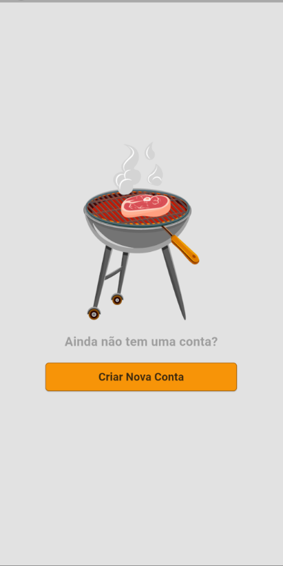
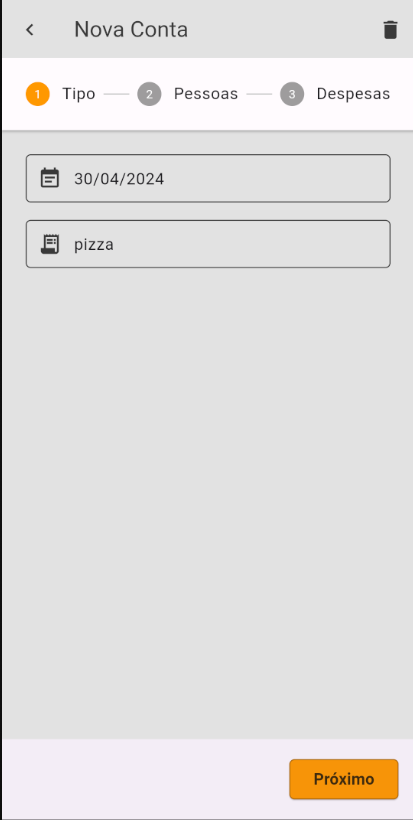
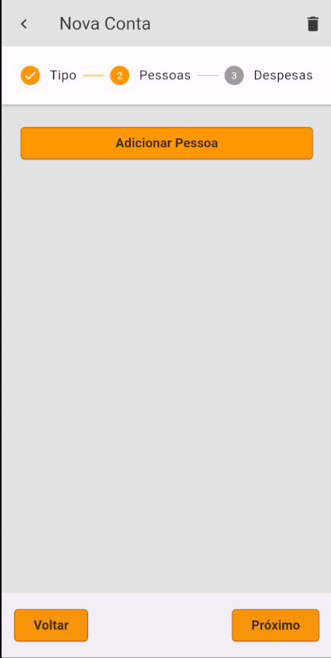
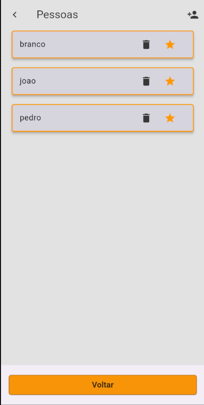
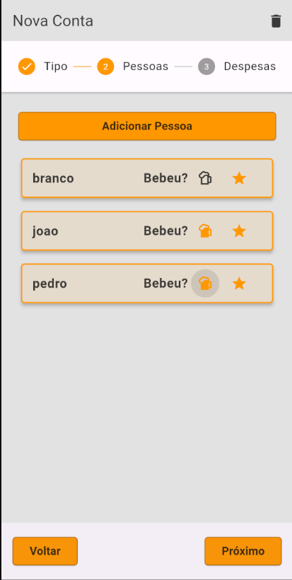
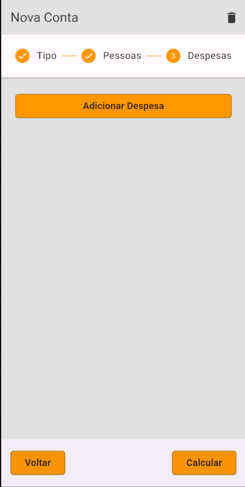
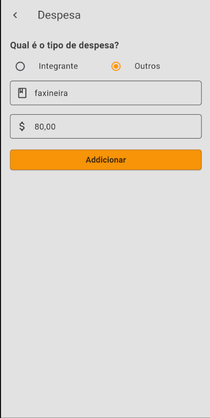
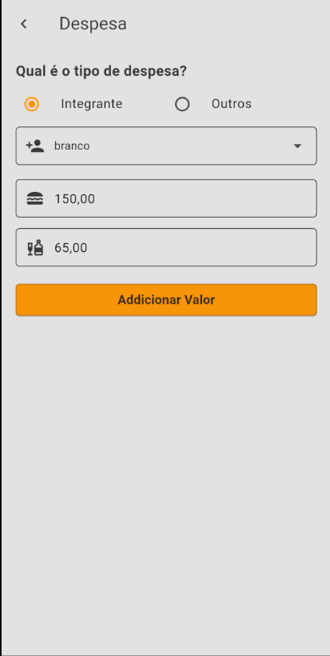
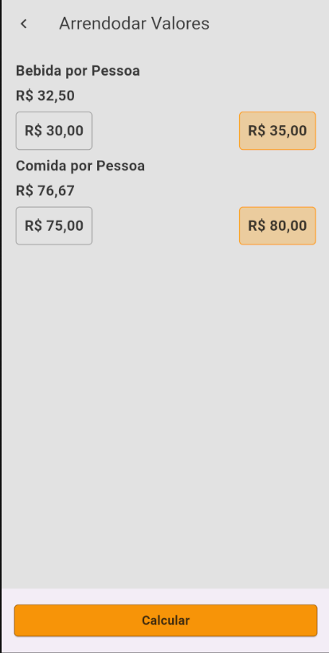
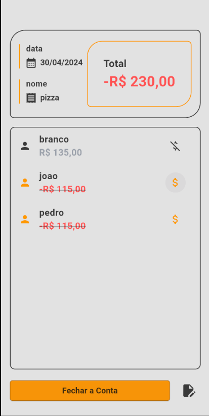

# DrinkEat

DrinkEat é um aplicativo projetado para facilitar a divisão de contas em encontros sociais, como um churrascos onde as pessoas costumam compartilhar despesas e automaticamente calcular quanto cada pessoa deve pagar.

## Funcionalidades

- Adição rápida de participantes e despesas
- Cálculo automático da divisão da conta
- Opção de divisão de quem bebeu somente
- Visualização clara do total devido por cada pessoa

## Desenvolvimento

Optei pelo Supabase devido à sua combinação de poder e facilidade de uso. Como este projeto envolve lidar com dados complexos e a necessidade de lidar eficientemente com a repetição de dados, o Supabase oferece uma solução abrangente. Sua API RESTful simplifica as operações de banco de dados, enquanto recursos como autenticação e armazenamento de arquivos integrados economizam tempo e esforço no desenvolvimento.

Além disso, o Supabase é uma solução escalável, o que significa que posso começar com um plano gratuito e expandir à medida que o projeto cresce, sem preocupações com migração de dados ou interrupções no serviço.

Em resumo, o Supabase se mostrou a escolha estratégica certa para este projeto, oferecendo uma base sólida para o desenvolvimento de um aplicativo robusto e escalável.

## Fotos

